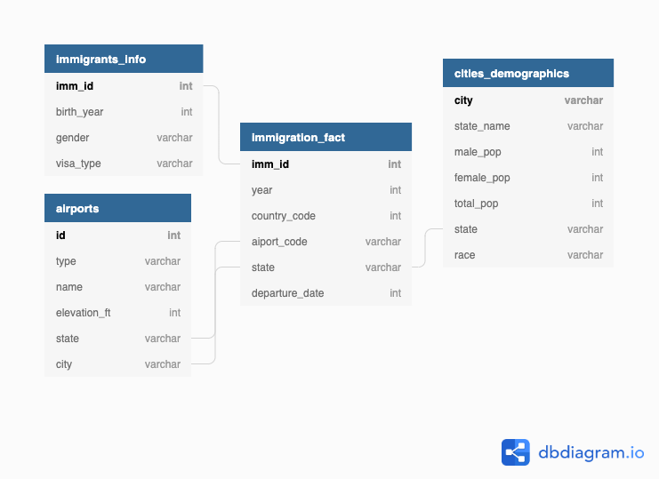

# IMMIGRATION ANALYSIS IN THE US!

#### Project Summary
The present project takes into account some US datasets regarding the immigration during a fixed amount of time
and performs some data pipelines in order to clean the raw dataset and create a data model that serves analytic
purposes, specifically the ones to answer the following questions:
* What is the state with most immigrants registered?
* How many airports have each of the top 10 cities with most immigrants?
* What is the state with greater immigrants/population rate?

The project follows the follow steps:
* Step 1: Scope the Project and Gather Data
* Step 2: Explore and Assess the Data
* Step 3: Define the Data Model
* Step 4: Run ETL to Model the Data
* Step 5: Complete Project Write Up

#### Scope 
The scope of the project is to read the following datasets in order to satisfy the analytical questions stated above:
* immigration_data (SAS format written in PARQUET files)
* airport-codes_csv (CSV format)
* us-cities-demographics (CSV format)

#### Database Schema
The database schema is presented as follows. It consists of 1 fact table with all immigration data needed to perform queries and 3 dimension tables that have all the information needed for the immigrant person, airports and cities demographics.

